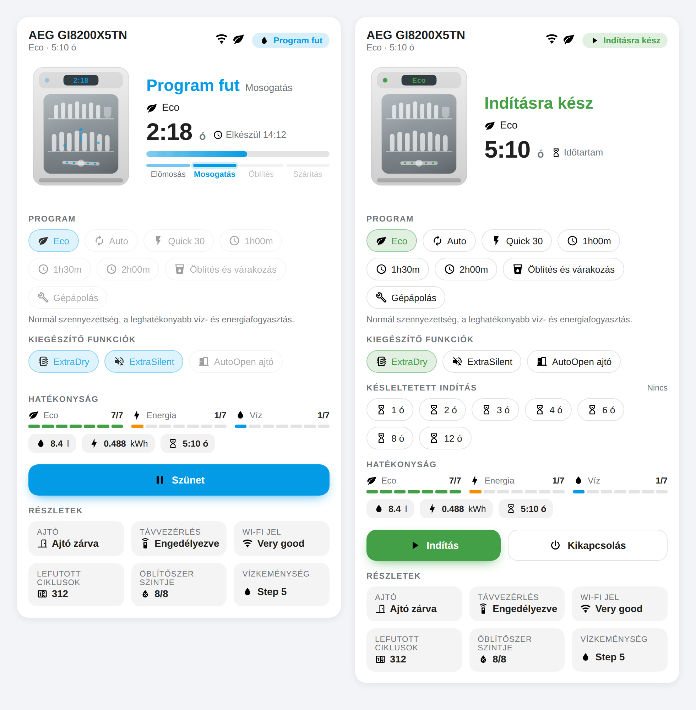
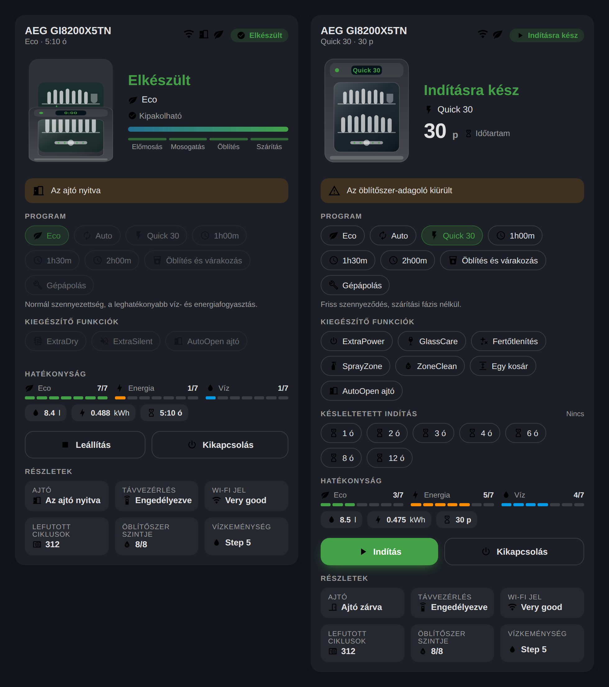
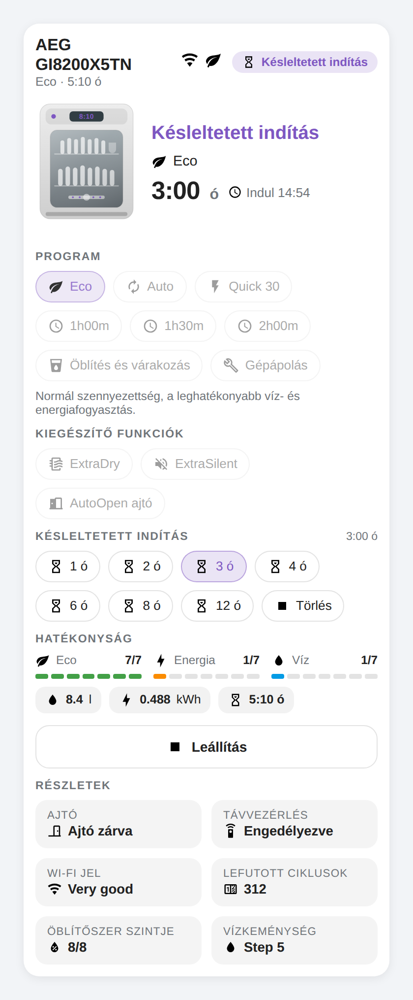

# AEG / Electrolux mosogatógép kártya

Lovelace kártya AEG és Electrolux mosogatógépekhez, amelyek a
[TTLucian/ha-electrolux](https://github.com/TTLucian/ha-electrolux) integráción
keresztül vannak bekötve a Home Assistantba. A kártya az **AEG GI8200X5TN**
diagnosztikai adataira és gépkönyvére épül, de minden olyan Electrolux
mosogatógéppel működik, amely ugyanezeket az entitásokat adja.



## Mit tud?

- **Animált géprajz**: forgó szórókar mosogatás közben, gőz a szárítási
  fázisban, csillogás a ciklus végén, kinyíló ajtó, ha nyitva az ajtó.
  A gép kijelzőjén a hátralévő idő látszik, akárcsak a valódi készüléken.
- **Hátralévő idő és pontos befejezés** (`Elkészül 14:12`), plusz becsült
  előrehaladás-sáv. Mivel a gép nem küld százalékot, a kártya a ciklus alatt
  látott leghosszabb hátralévő időből (illetve a program névleges hosszából)
  számolja.
- **Fázis-idővonal**: Előmosás → Mosogatás → Öblítés → Szárítás. A kiválasztott
  program által nem használt fázisok halványak.
- **Programválasztó** a gépkönyv szerinti nevekkel (Eco, Auto, Quick 30,
  1h00m, 1h30m, 2h00m, Öblítés és várakozás, Gépápolás), a hozzájuk tartozó
  víz-/energiafogyasztással és leírással.
- **Kiegészítő funkciók** (ExtraDry, ExtraPower, ExtraSilent, GlassCare,
  Fertőtlenítés, SprayZone, ZoneClean, Egy kosár, AutoOpen ajtó) – csak azok
  jelennek meg, amelyeket az adott program támogat.
- **Késleltetett indítás** egy kattintással (1–12 óra) és törlés.
- **Vezérlőgombok** a gép állapotához igazítva: bekapcsolás, indítás, szünet,
  folytatás, leállítás, kikapcsolás.
- **Riasztások magyarul**: sóhiány, öblítőszer-hiány, i10/i20/i30/iF1 hibakódok
  a gépkönyv szerinti magyarázattal, plusz nyitott ajtó és offline állapot.
- **Eco / energia / víz pontszámok**, lefutott ciklusok, öblítőszerszint,
  vízkeménység, Wi-Fi jelminőség, távvezérlés állapota.
- Magyar és angol nyelv, világos/sötét téma, kompakt nézet, vizuális
  konfigurációs szerkesztő, HA `sections` elrendezés támogatása.

| Sötét téma | Mobil / kompakt |
| --- | --- |
|  |  |

## Telepítés

### HACS (ajánlott)

1. HACS → Frontend → jobb felső menü → **Custom repositories**
2. URL: `https://github.com/gabor-io/ha-appliance-custom-card`, kategória: **Lovelace**
3. Telepítés után a HACS magától felveszi az erőforrást.

### Kézzel

1. Másold a `dist/aeg-dishwasher-card.js` fájlt a `config/www/` könyvtárba.
2. Beállítások → Irányítópultok → ⋮ → **Erőforrások** → Erőforrás hozzáadása:
   - URL: `/local/aeg-dishwasher-card.js`
   - Típus: **JavaScript modul**
3. Ctrl+F5 a böngészőben.

## Használat

A legtöbb esetben ennyi elég – a kártya magától megkeresi a mosogatógép
entitásait:

```yaml
type: custom:aeg-dishwasher-card
```

Ha több Electrolux készüléked van, add meg a készüléket (a vizuális szerkesztő
legördülőjéből is választható):

```yaml
type: custom:aeg-dishwasher-card
device: 6fd23c0061402c12a296ee8cd6b656a9
name: Mosogatógép
```

További példák: [`examples/lovelace.yaml`](examples/lovelace.yaml).

## Beállítások

| Opció | Típus | Alapértelmezés | Leírás |
| --- | --- | --- | --- |
| `type` | string | – | `custom:aeg-dishwasher-card` |
| `device` | string | automatikus | A készülék `device_id`-ja |
| `prefix` | string | automatikus | Az entitások közös előtagja, pl. `aeg_gi8200x5tn` |
| `entities` | map | automatikus | Egyedi entitás-hozzárendelés (lásd lentebb) |
| `name` | string | a készülék neve | Fejléc felirat |
| `language` | `auto` \| `hu` \| `en` | `auto` | A kártya nyelve |
| `compact` | bool | `false` | Kisebb géprajz és sűrűbb elrendezés |
| `animate` | bool | `true` | Animációk ki/be |
| `show_programs` | bool | `true` | Programválasztó |
| `show_options` | bool | `true` | Kiegészítő funkciók |
| `show_delay` | bool | `true` | Késleltetett indítás |
| `show_scores` | bool | `true` | Eco/energia/víz pontszámok |
| `show_consumption` | bool | `true` | Víz-/energiafogyasztás, időtartam |
| `show_details` | bool | `true` | Részletek rács |
| `show_controls` | bool | `true` | Vezérlőgombok |

Az `entities` alatt felülírható kulcsok: `appliance_state`, `cycle_phase`,
`time_to_end`, `alerts`, `eco_score`, `energy_score`, `water_score`,
`total_cycle_counter`, `remote_control`, `link_quality`, `door_state`,
`connectivity`, `eco_mode`, `program`, `water_hardness`, `start_time`,
`rinse_aid_level`, `cmd_on`, `cmd_off`, `cmd_start`, `cmd_pause`, `cmd_resume`,
`cmd_stopreset`.

## Jó tudni

- **Távvezérlés**: a gép csak akkor fogadja a parancsokat, ha a készüléken
  engedélyezett a távindítás (`sensor.*_remote_control`). Ha tiltva van, a
  kártya kiszürkíti a gombokat és jelzi az okot.
- **Program választása kikapcsolt gépnél**: a kártya előbb megnyomja az
  `execute_command_on` gombot, vár másfél másodpercet, és utána állítja be a
  programot.
- **Hátralévő idő mértékegysége**: a kártya az entitás `unit_of_measurement`
  attribútumát nézi, így perc és másodperc alapú érték is jó.
- **Előrehaladás**: böngészőnként (localStorage) tárolódik a ciklus becsült
  hossza; privát ablakban a program névleges ideje szolgál alapul.

## Fejlesztés

```bash
npm install
npm run build      # dist/aeg-dishwasher-card.js
npm run watch      # figyelő módban, minifikálás nélkül
npm run serve      # http://localhost:8099/demo/ – demó valódi adatokból épített mock hass-szal
```

A `demo/` mappa az igazi diagnosztikai fájlból származó állapotokat játssza
vissza (fut, szárít, szünetel, késleltetve indul, elkészült, hiba, offline),
így a kártya HA nélkül is fejleszthető.

A készülék entitásainak és képességeinek összefoglalója:
[`docs/appliance-capabilities.md`](docs/appliance-capabilities.md).

## Licenc

MIT
