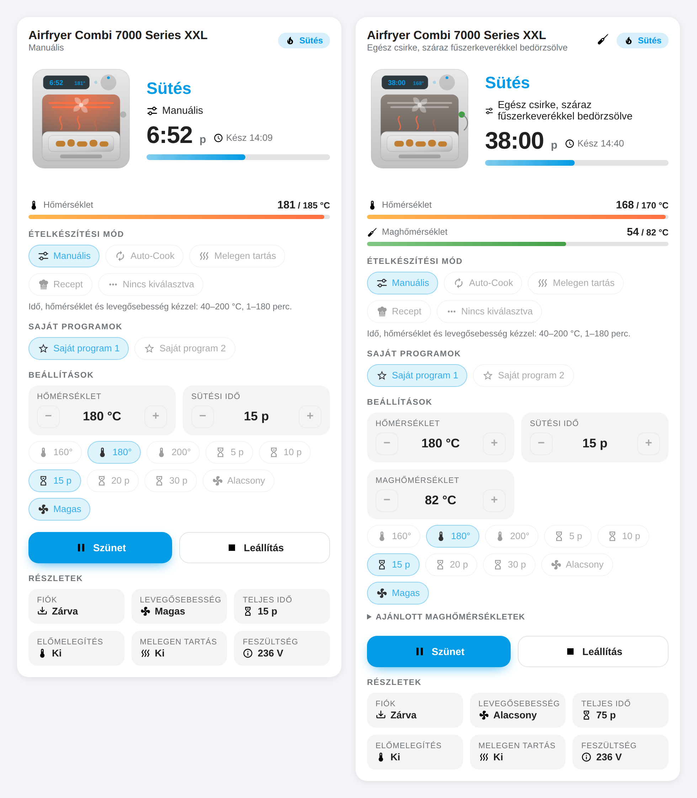
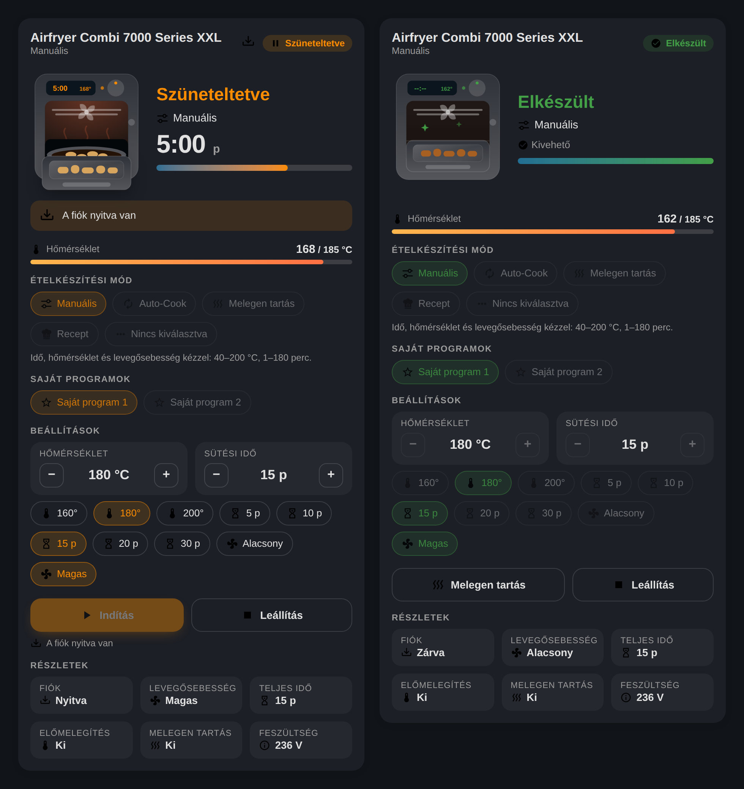
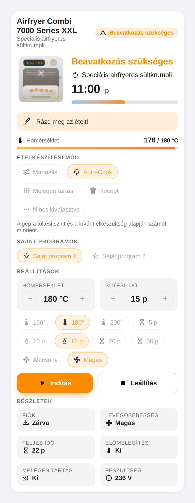

# Home Appliance Cards

Két Lovelace kártya háztartási gépekhez, közös alapokon:

| Kártya | Készülék | Integráció |
| --- | --- | --- |
| `custom:aeg-dishwasher-card` | AEG / Electrolux mosogatógép (fejlesztve: **GI8200X5TN**) | [TTLucian/ha-electrolux](https://github.com/TTLucian/ha-electrolux) |
| `custom:philips-airfryer-card` | Philips airfryer (fejlesztve: **HD9880 Combi 7000 XXL**) | [renaudallard/homeassistant_philips_homeid](https://github.com/renaudallard/homeassistant_philips_homeid) |

Mindkét kártya animált géprajzot, valós állapotkövetést és vezérlést ad,
magyar és angol nyelven, világos és sötét témában.

## Mosogatógép kártya


- **Animált géprajz**: mosogatás közben forgó szórókar, vízsugarak, hullámzó
  vízszint és felszálló buborékok, gőz a szárítási fázisban, csillogás a ciklus
  végén, a gép kijelzőjén a hátralévő idő.
- **Ajtó és bekapcsolt állapot a képen**: nyitott ajtónál a gép ajtaja lehajlik
  és árnyékot vet, kikapcsolt gépnél sötét a kijelző, a jelzőfény és a belső
  világítás is.
- **Mindig látszik, mikor lesz kész**: bekapcsolt gépnél a kártya akkor is
  kiírja a pontos befejezési időpontot (`Elkészül 19:51`), ha a program még el
  sem indult – a géptől kapott időtartamot használja, ami a bekapcsolt
  kiegészítő funkciókat (pl. ExtraDry, ExtraSilent) is tartalmazza, és csak
  ennek hiányában esik vissza a gépkönyv névleges idejére.
- **Futó ciklusnál** a hátralévő idő, a befejezés időpontja és egy
  előrehaladás-sáv. A gép nem küld százalékot, ezért a ciklus alatt látott
  leghosszabb hátralévő időből (illetve a program névleges hosszából) számol.
- **Fázis-idővonal**: Előmosás → Mosogatás → Öblítés → Szárítás; a program által
  nem használt fázisok halványak.
- **Programválasztó** a gépkönyv szerinti nevekkel, víz-/energiafogyasztással.
- **Kiegészítő funkciók** csak ott, ahol az adott program elfogadja őket.
- **Késleltetett indítás** 1–12 óra, egy kattintással – ilyenkor azt is kiírja,
  hogy a gép mikor indul, illetve a késleltetéssel és a választott programmal
  együtt mikor lesz kész (`Indul 16:28 · Elkészül 21:38`).
- **Riasztások magyarul**: sóhiány, öblítőszer-hiány, i10/i20/i30/iF1 hibakódok.
- Eco/energia/víz pontszámok, ciklusszám, öblítőszerszint, vízkeménység,
  Wi-Fi jelminőség, távvezérlés állapota.

Részletek: [`docs/dishwasher-capabilities.md`](docs/dishwasher-capabilities.md),
példák: [`examples/dishwasher.yaml`](examples/dishwasher.yaml).

## Airfryer kártya



- **Animált géprajz**: pörgő ventilátor, izzó fűtőszál, felszálló hő, gőz a
  párolós módokban, pirulő étel.
- **Nyitott / csukott fiók a képen**: csukva egybefüggő előlap, nyitva a fiók
  kicsúszik a néző felé, árnyékot vet, mögötte sötét rés, és felülnézetből
  látszik a kosár a benne lévő étellel. Ugyanez megjelenik figyelmeztető sávként
  (sütés közben „a fiók nyitva – a sütés szünetel”), fejlécikonként és a
  Részletek között; nyitott fióknál az indítás gomb le van tiltva.
- **Rázás- és fordításemlékeztető animációval**: a fiók rázkódik, az étel
  ugrál benne, a fiók körvonala felvillan, mellé villogó figyelmeztető sáv
  (manuális módban a beállított idő felénél szól a gép).
- **Hátralévő idő** perc:másodperc pontossággal, pontos befejezési időponttal és
  előrehaladás-sávval (a gép a teljes és a hátralévő időt is küldi).
- **Hőmérséklet-mérő**: aktuális / cél, és **ételhőmérő** esetén a maghőmérséklet
  külön mérővel, valamint a gépkönyv ajánlott maghőmérséklet-táblázatával.
- **Ételkészítési módok és saját programok** választása, hőmérséklet/idő/
  maghőmérséklet állítása léptetőkkel és gyorsgombokkal, levegősebesség.
- **Állapotfüggő vezérlés**: bekapcsolás, indítás, szünet, leállítás, melegen
  tartás.

Részletek: [`docs/airfryer-capabilities.md`](docs/airfryer-capabilities.md),
példák: [`examples/airfryer.yaml`](examples/airfryer.yaml).

| Sötét téma | Mobil / kompakt |
| --- | --- |
|  |  |

## Telepítés

> **Ez a repó privát.** A HACS hivatalosan csak publikus repókat támogat, ezért
> privát repónál a kézi telepítés a biztos út. (Ha később publikussá teszed a
> repót, a HACS-os mód is működik – lásd lentebb.)

### Kézzel (privát repónál ez ajánlott)

1. Töltsd le a `dist/ha-appliance-cards.js` fájlt – ez tartalmazza mindkét
   kártyát. (Ha csak az egyik kell: `dist/aeg-dishwasher-card.js`, illetve
   `dist/philips-airfryer-card.js`.)
   - GitHub böngészőből: a fájl oldalán **Download raw file**.
   - Vagy a Home Assistant gépén, személyes hozzáférési tokennel (fine-grained
     token, `Contents: Read` jogosultsággal az adott repóra):

     ```bash
     curl -L \
       -H "Authorization: Bearer <GITHUB_TOKEN>" \
       -H "Accept: application/vnd.github.raw" \
       -o /config/www/ha-appliance-cards.js \
       "https://api.github.com/repos/gabor-io/ha-appliance-custom-card/contents/dist/ha-appliance-cards.js?ref=main"
     ```

2. A fájl kerüljön a `config/www/` könyvtárba (ha még nincs, hozd létre); ez a
   `/local/` útvonalon érhető el.
3. Beállítások → Irányítópultok → ⋮ (jobb felül) → **Erőforrások** → jobb alul
   **+ Erőforrás hozzáadása**:
   - URL: `/local/ha-appliance-cards.js?v=1`
   - Típus: **JavaScript modul**
4. Ctrl+F5 (vagy Cmd+Shift+R) a böngészőben.

Frissítéskor töltsd le újra a fájlt, és növeld az erőforrás URL végén a `?v=`
értéket (`?v=2`, `?v=3`, …), hogy a böngésző ne a régi verziót töltse be.
A letöltést a [`scripts/update-card.sh`](scripts/update-card.sh) automatizálja –
lásd a következő szakaszt.

### HACS (ha publikussá teszed a repót)

1. HACS → ⋮ → **Custom repositories**
2. URL: `https://github.com/gabor-io/ha-appliance-custom-card`, típus: **Dashboard**
3. Telepítés után a HACS magától felveszi a `ha-appliance-cards.js` erőforrást.

### Automatikus frissítés a GitHubról

A [`scripts/update-card.sh`](scripts/update-card.sh) letölti a repóból az aktuális
buildet a Home Assistant `www` mappájába. Privát repónál kell hozzá egy
fine-grained GitHub token (`Contents: Read` az adott repóra), publikusnál token
nélkül is megy.

```bash
GITHUB_TOKEN=github_pat_... ./scripts/update-card.sh
```

Amit tud:

- csak akkor tölt le, ha a fájl tényleg változott (a blob SHA-ját eltárolja a
  cél mellé `.sha` néven), így időzítve is nyugodtan futtatható;
- `--ref latest` esetén a legutóbbi GitHub Release-t húzza le (ha nincs release,
  a `main` branchre esik vissza), `--ref main` (alapértelmezés) mindig a legfrissebb állapotot;
- a letöltést ellenőrzi, és csak ép fájlt tesz a helyére – félbeszakadt letöltés
  soha nem írja felül a működő kártyát;
- `--file`, `--dest`, `--repo`, `--quiet` kapcsolókkal testre szabható
  (mindegyik megadható környezeti változóként is: `REPO`, `REF`, `FILE`, `DEST`,
  `GITHUB_TOKEN`).

**Időzítés a Docker hoston** (HA Container telepítésnél ez a legegyszerűbb) –
`crontab -e`:

```
0 4 * * * GITHUB_TOKEN=github_pat_... /opt/ha/update-card.sh --quiet --dest /path/to/ha-config/www/ha-appliance-cards.js
```

**Vagy magából a Home Assistantból**, `secrets.yaml`:

```yaml
update_cards_cmd: "GITHUB_TOKEN=github_pat_... /config/scripts/update-card.sh --quiet"
```

`configuration.yaml`:

```yaml
shell_command:
  update_appliance_cards: !secret update_cards_cmd
```

…majd egy automatizálás naponta (vagy HA indulásakor) hívja meg a
`shell_command.update_appliance_cards` műveletet. Előtte futtasd le kézzel a
Fejlesztői eszközök → Műveletek alatt: ha a konténerben nincs `curl`, a hostos
cron a megoldás.

Frissítés után a böngészőben Ctrl+F5, vagy növeld a Lovelace erőforrás URL-jében
a `?v=` értéket.

## Használat

A kártyák maguktól megkeresik a készülék entitásait:

```yaml
type: custom:aeg-dishwasher-card
```

```yaml
type: custom:philips-airfryer-card
```

Ha több hasonló készüléked van, add meg a készüléket (a vizuális szerkesztő
legördülőjéből is választható):

```yaml
type: custom:philips-airfryer-card
device: 8f1c0a2b5d7e4f3a9c6b1d2e3f4a5b6c
name: Airfryer
```

## Beállítások

Közös opciók mindkét kártyán:

| Opció | Típus | Alapértelmezés | Leírás |
| --- | --- | --- | --- |
| `device` | string | automatikus | A készülék `device_id`-ja |
| `prefix` | string | automatikus | Az entitások közös előtagja |
| `entities` | map | automatikus | Egyedi entitás-hozzárendelés |
| `name` | string | a készülék neve | Fejléc felirat |
| `language` | `auto` \| `hu` \| `en` | `auto` | A kártya nyelve |
| `compact` | bool | `false` | Kisebb géprajz, sűrűbb elrendezés |
| `animate` | bool | `true` | Animációk ki/be |
| `show_details` | bool | `true` | Részletek rács |
| `show_controls` | bool | `true` | Vezérlőgombok |

Csak a mosogatógép kártyán: `show_programs`, `show_options`, `show_delay`,
`show_scores`, `show_consumption`.

Csak az airfryer kártyán: `show_methods`, `show_presets`, `show_settings`,
`show_probe`.

Az `entities` alatt felülírható kulcsok a két `docs/*-capabilities.md` fájl
végén találhatók.

## Jó tudni

- **Mosogatógép távvezérlés**: a gép csak akkor fogadja a parancsokat, ha
  engedélyezett a távindítás; a kártya kiszürkíti a gombokat és jelzi az okot.
- **Program választása kikapcsolt mosogatógépen**: a kártya előbb megnyomja az
  `execute_command_on` gombot, vár 1,5 másodpercet, és utána állít programot.
- **Airfryer fiók**: nyitott fióknál a gép szünetel, a kártya nem enged indítást.
- **Mértékegységek**: a kártyák az entitások `unit_of_measurement` attribútumát
  követik, így °C/°F és perc/másodperc alapú érték is jó.

## Fejlesztés

```bash
npm install
npm run build      # dist/*.js (mindhárom bundle)
npm run watch      # figyelő mód, minifikálás nélkül
npm run serve      # http://localhost:8099/demo/ – demók mock hass-szal
```

```
src/
├── shared/      # entitásfelismerés, i18n, ikonok, alapstílusok, szerkesztő
├── dishwasher/  # AEG / Electrolux mosogatógép kártya
└── airfryer/    # Philips airfryer kártya
```

A `demo/` mappa a valódi diagnosztikai adatokból épített állapotokat játssza
vissza (mosogatógép: fut, szárít, szünetel, késleltetve indul, elkészült, hiba,
offline; airfryer: előmelegít, süt, rázás, nyitott fiók, ételhőmérő, párolás,
elkészült, melegen tart, hiba), így a kártyák HA nélkül is fejleszthetők.

## Licenc

MIT
